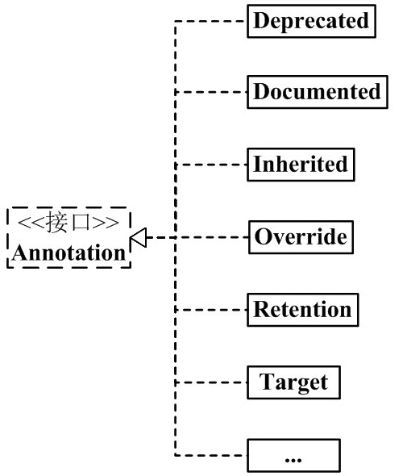

## Java注解

Java 注解（Annotation）又称 Java 标注，是 JDK5.0 引入的一种注释机制。

Java 语言中的类、方法、变量、参数和包等都可以被标注。和 Javadoc 不同，Java 标注可以通过反射获取标注内容。在编译器生成类文件时，标注可以被嵌入到字节码中。Java 虚拟机可以保留标注内容，在运行时可以获取到标注内容 。 当然它也支持自定义 Java 标注。


### Java内置的注解

Java 定义了一套注解，共有 7 个，3 个在 java.lang 中，剩下 4 个在 java.lang.annotation 中。

作用在代码的注解是：
```text
@Override - 检查该方法是否是重写方法。如果发现其父类，或者是引用的接口中并没有该方法时，会报编译错误。
@Deprecated - 标记过时方法。如果使用该方法，会报编译警告。
@SuppressWarnings - 指示编译器去忽略注解中声明的警告。
作用在其他注解的注解(或者说 元注解)是:

@Retention - 标识这个注解怎么保存，是只在代码中，还是编入class文件中，或者是在运行时可以通过反射访问。
@Documented - 标记这些注解是否包含在用户文档中。
@Target - 标记这个注解应该是哪种 Java 成员。
@Inherited - 标记这个注解是继承于哪个注解类(默认 注解并没有继承于任何子类)
```

从 Java 7 开始，额外添加了 3 个注解:

```text
@SafeVarargs - Java 7 开始支持，忽略任何使用参数为泛型变量的方法或构造函数调用产生的警告。
@FunctionalInterface - Java 8 开始支持，标识一个匿名函数或函数式接口。
@Repeatable - Java 8 开始支持，标识某注解可以在同一个声明上使用多次。
```


### Annotation 组成部分

Annotation.java
```Java
package java.lang.annotation;
public interface Annotation {
    boolean equals(Object obj);
    int hashCode();
    String toString();
    Class<? extends Annotation> annotationType();
}
```
ElementType.java
```Java
package java.lang.annotation;
public enum ElementType {
    TYPE,               /* 类、接口（包括注释类型）或枚举声明  */
    FIELD,              /* 字段声明（包括枚举常量）  */
    METHOD,             /* 方法声明  */
    PARAMETER,          /* 参数声明  */
    CONSTRUCTOR,        /* 构造方法声明  */
    LOCAL_VARIABLE,     /* 局部变量声明  */
    ANNOTATION_TYPE,    /* 注释类型声明  */
    PACKAGE             /* 包声明  */
}
```

RetentionPolicy.java
```Java
package java.lang.annotation;
public enum RetentionPolicy {
    SOURCE,            /* Annotation信息仅存在于编译器处理期间，编译器处理完之后就没有该Annotation信息了  */
    CLASS,             /* 编译器将Annotation存储于类对应的.class文件中。默认行为  */
    RUNTIME            /* 编译器将Annotation存储于class文件中，并且可由JVM读入 */
}
```

SOURCE： " @Override" 标志就是一个 Annotation。当它修饰一个方法的时候，就意味着该方法覆盖父类的方法；并且在编译期间会进行语法检查！编译器处理完后，"@Override" 就没有任何作用了。

CLASS：编译器将 Annotation 存储于类对应的 .class 文件中，它是 Annotation 的默认行为。

RUNTIME： 编译器将 Annotation 存储于 class 文件中，并且可由JVM读入。

### 自定义一个Annotation

```
@Documented
@Target(ElementType.TYPE)
@Retention(RetentionPolicy.RUNTIME)
public @interface MyAnnotation{
}
```

 - @interface 定义注解时，意味着它实现了 java.lang.annotation.Annotation 接口，即该注解就是一个Annotation。Annotation 接口的实现细节都由编译器完成。通过 @interface 定义注解后，该注解不能继承其他的注解或接口。

- @Documented 修饰该 Annotation，则表示它可以出现在 javadoc 中。

- @Target(ElementType.TYPE) 的意思就是指定该 Annotation 的类型是 ElementType.TYPE。这就意味着，MyAnnotation 是来修饰"类、接口（包括注释类型）或枚举声明"的注解。

```
@Target({TYPE, FIELD, METHOD, PARAMETER, CONSTRUCTOR, LOCAL_VARIABLE}) -- 它的作用是指定 SuppressWarnings 的类型同时包括TYPE, FIELD, METHOD, PARAMETER, CONSTRUCTOR, LOCAL_VARIABLE。
TYPE 意味着，它能标注"类、接口（包括注释类型）或枚举声明"。
FIELD 意味着，它能标注"字段声明"。
METHOD 意味着，它能标注"方法"。
PARAMETER 意味着，它能标注"参数"。
CONSTRUCTOR 意味着，它能标注"构造方法"。
LOCAL_VARIABLE 意味着，它能标注"局部变量"。
```

- @Retention(RetentionPolicy.RUNTIME) 的意思就是指定该 Annotation 的策略是 RetentionPolicy.RUNTIME。这就意味着，编译器会将该 Annotation 信息保留在 .class 文件中，并且能被虚拟机读取。



java 常用的Annotation：

```java
@Deprecated  -- @Deprecated 所标注内容，不再被建议使用。
@Override    -- @Override 只能标注方法，表示该方法覆盖父类中的方法。
@Documented  -- @Documented 所标注内容，可以出现在javadoc中。
@Inherited   -- @Inherited只能被用来标注“Annotation类型”，它所标注的Annotation具有继承性。
@Retention   -- @Retention只能被用来标注“Annotation类型”，而且它被用来指定Annotation的RetentionPolicy属性。
@Target      -- @Target只能被用来标注“Annotation类型”，而且它被用来指定Annotation的ElementType属性。
@SuppressWarnings -- @SuppressWarnings 所标注内容产生的警告，编译器会对这些警告保持静默。
```

@SuppressWarnings 的作用是，让编译器对"它所标注的内容"的某些警告保持静默

```
deprecation  -- 使用了不赞成使用的类或方法时的警告
unchecked    -- 执行了未检查的转换时的警告，例如当使用集合时没有用泛型 (Generics) 来指定集合保存的类型。
fallthrough  -- 当 Switch 程序块直接通往下一种情况而没有 Break 时的警告。
path         -- 在类路径、源文件路径等中有不存在的路径时的警告。
serial       -- 当在可序列化的类上缺少 serialVersionUID 定义时的警告。
finally      -- 任何 finally 子句不能正常完成时的警告。
all          -- 关于以上所有情况的警告。
```

### Annotation 的作用

Annotation 是一个辅助类，它在 Junit、Struts、Spring 等工具框架中被广泛使用。

我们在编程中经常会使用到的 Annotation 作用有：
1. 编译检查 :若某个方法被 @Override 的标注，则意味着该方法会覆盖父类中的同名方法。如果有方法被 @Override 标示，但父类中却没有"被 @Override 标注"的同名方法，则编译器会报错。
2. 在反射中使用 Annotation, 在反射的 Class, Method, Field 等函数中，有许多于 Annotation 相关的接口。这也意味着，我们可以在反射中解析并使用 Annotation。
3. 根据 Annotation 生成帮助文档:@Documented 标签，能使该 Annotation 标签出现在 javadoc 中
4. 理解代码的结构: 通过 @Override, @Deprecated 等，我们能很方便的了解程序的大致结构。

### 案例1 使用注解配置日志

创建日志注解
```java
@Retention(RetentionPolicy.RUNTIME)
@interface LoggerAnnotation {
    String[] value() default "unknown";
}
```
使用注解配置日志
```java
public class Logger {
    /**
     * empty()方法同时被 "@Deprecated" 和 "@LoggerAnnotation(value={"a","b"})"所标注
     * (01) @Deprecated，意味着empty()方法，不再被建议使用
     * (02) @LoggerAnnotation, 意味着empty() 方法对应的LoggerAnnotation的value值是默认值"unknown"
     */
    @LoggerAnnotation
    @Deprecated
    public void empty(){
        System.out.println("\nempty");
    }

    /**
     * printLogger() 被 @LoggerAnnotation(value={"test","method"}) 所标注，
     * @LoggerAnnotation(value={"test","method"}), 意味着MyAnnotation的value值是{"test","method"}
     */
    @LoggerAnnotation(value={"test","method"})
    public void printLogger(String clzName, int paramsCount){
        System.out.println("\nclassName: "+clzName+", params count: "+paramsCount);
    }
}
```

```java
public class AnnotationTest {
    public static void main(String[] args) throws Exception {
        // 新建Logger
        Logger logger = new Logger();
        // 获取Logger的Class实例
        Class<Logger> c = Logger.class;
        // 获取 printLogger() 方法的Method实例
        Method method = c.getMethod("printLogger", new Class[]{String.class, int.class});
        // 执行该方法
        method.invoke(logger, new Object[]{"Test", 2});
        iteratorAnnotations(method);

        // 获取方法的Method实例
        Method emptyMethod = c.getMethod("empty", new Class[]{});
        // 执行该方法
        emptyMethod.invoke(logger, new Object[]{});
        iteratorAnnotations(emptyMethod);
    }

    public static void iteratorAnnotations(Method method) {

        // 判断方法是否包含LoggerAnnotation注解
        if(method.isAnnotationPresent(LoggerAnnotation.class)){
            // 获取该方法的MyAnnotation注解实例
            LoggerAnnotation testAnnotation = method.getAnnotation(LoggerAnnotation.class);
            // 获取 myAnnotation的值，并打印出来
            String[] values = testAnnotation.value();
            for (String str:values){
                System.out.printf(str+", ");
            }
            System.out.println();
        }

        // 获取方法上的所有注解，并打印出来
        Annotation[] annotations = method.getAnnotations();
        for(Annotation annotation : annotations){
            System.out.println(annotation);
        }
    }
}
```

查看结果
```
className: Test, params count: 2
test, method,
@logger.LoggerAnnotation(value=[test, method])

empty
unknown,
@logger.LoggerAnnotation(value=[unknown])
@java.lang.Deprecated()
```
### 案例2 使用注解加载需要的方法

定义MyService方法
```java
@Retention(RetentionPolicy.RUNTIME)
public @interface MyServiceAnnotation {
    String value() default "unknown";
}
```

定义服务接口
```java
public interface MyService {
    /**
     * 添加注解后的服务
     */
    String printLogger();

    /**
     * 不添加注解的服务
     */
    String printLoggerUnAnnotation();
}
```

实现接口
```java
public class MyServiceImpl implements MyService{

    @MyServiceAnnotation(value="printLogger")
    @Override
    public String printLogger(){
        System.out.println("Add MyServiceAnnotation Method!");
        return "MyServiceAnnotation Method";
    }

    @Override
    public String printLoggerUnAnnotation(){
        System.out.println("Add MyService without Annotation Method!");
        return "Without MyServiceAnnotation Method";
    }
}
```
定义获取注解的方法的utils
```java
public class BeanUtils {
    /**
     * 获取注解方法
     * @param invocation
     * @param clz 注解类型
     * @return 方法，未找到为null
     * @throws Throwable 异常
     */
    public static Method getAnnotationMethod(final MethodInvocation invocation, final Class<? extends Annotation> clz) throws Throwable {
        // 获取接口方法
        final Method interfaceMethod = invocation.getMethod();
        // 获取实现方法
        final Method implementMethod = BeanUtils.getImplMethod(invocation.getThis(), interfaceMethod);
        // 优先获取实现类注解
        if (null != implementMethod && implementMethod.isAnnotationPresent(clz)) {
            return implementMethod;
        }

        if (interfaceMethod.isAnnotationPresent(clz)) {
            return interfaceMethod;
        }
        return null;
    }
}
```

定义工厂方法，获取类中被标记了特定注解的方法
```java
public class Factory implements MethodInterceptor {

    @Override
    public Object invoke(MethodInvocation methodInvocation) throws Throwable {
        Object result = null;
        //获取注解方法
        final Method method = BeanUtils.getAnnotationMethod(methodInvocation, MyServiceAnnotation.class);
        if (null != method) {
            MyServiceAnnotation testAnnotation = method.getAnnotation(MyServiceAnnotation.class);
            String value = testAnnotation.value();
            System.out.println("method name " + value);
            System.out.println("--------------");
            result = methodInvocation.proceed();
            System.out.println("--------------");
        }
        return result;
    }
}
```
测试注解方法
```java
public class TestMyService {
    public static void main(String[] args) {
        ProxyFactory proxyFactory = new ProxyFactory();
        proxyFactory.setTarget(new MyServiceImpl());
        proxyFactory.addAdvice(new Factory());

        Object proxy = proxyFactory.getProxy();
        MyService myService = (MyService) proxy;

        // 该方法会执行
        System.out.println(myService.printLogger());
        System.out.println("**************");
        // 该方法不会执行
        System.out.println(myService.printLoggerUnAnnotation());
    }
}
```

```
method name printLogger
--------------
Add MyServiceAnnotation Method!
--------------
MyServiceAnnotation Method
**************
null
```

Spring中采用@Service实现对相关bean的创建，类似上述方法
